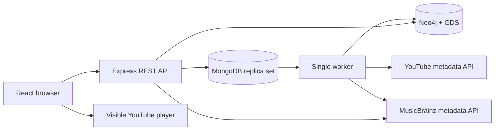
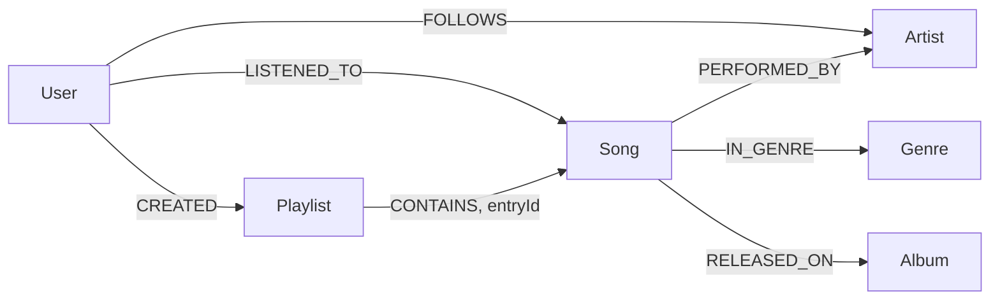

# Architecture and contracts

## Authoritative data

Eight domain collections implement the supplied PDF: `users`, `artists`, `albums`, `songs`, `genres`, `playlists`, `follows`, and `playback_sessions`. UUID strings link records; BSON UTC dates store timestamps. `sync_outbox` contains durable reconciliation tasks. `auth_sessions`, `import_jobs`, `app_state`, `provider_limits`, and `worker_lock` are operational collections and do not count toward the PDF's domain fixture totals.

MongoDB validators protect core structural invariants. Zod request schemas validate enums, UUIDs, ranges, and bounded arrays. Service transactions verify references and touch dependency records, causing write conflicts with concurrent retirement. Each song belongs to one release; artist names need not be unique. Catalog retirement preserves historical references. Retiring an album/artist with active dependents is rejected; retire dependents explicitly first.

Authoritative changes and outbox tasks share a MongoDB transaction. Playlist writes compare expected versions and reject concurrent edits with HTTP 409. Entry identity differs from song identity, allowing repeated songs. Positions remain contiguous; entry count is capped at 500. Reads compute duration and current display names. Existing retired tracks stay visible as unavailable.

## Graph projection

The worker reloads a consistent MongoDB snapshot and replaces the complete small graph in a single Neo4j transaction. This is a deliberate classroom implementation of current-state reconciliation: it trades incremental-write efficiency for simple atomic publication, removed-edge correctness, and retry safety. There are no placeholder nodes or increment-on-retry counters. Ordinary pending changes are polled every two seconds; a full reconciliation also runs every five minutes. Only this worker writes the graph, including GDS projections. A MongoDB lease rejects a second worker.

Tasks are acknowledged after graph commit. A crash in between leads to a harmless repeat projection. Exponential retry delay is capped at five minutes; after ten failures a task remains inspectable as failed. Neo4j downtime does not block MongoDB writes. Recommendations use bounded graph calls and fall back to MongoDB popularity.

Graph nodes contain public catalog metadata and pseudonymous opted-in user IDs, never email, password, session tokens, or private profiles. Private playlists and opted-out users are absent. API graph responses recheck eligibility/visibility against MongoDB to account for lag.

## Playback

The browser uses a persistent, visible YouTube IFrame player. There is no audio extraction, media proxy, file download, offline player, or media storage endpoint. YouTube's controls and attribution remain visible. The player pauses when the document is hidden.

A server session starts when playback enters PLAYING. Pause/resume retains session identity. Track change and repeat create new attempts. The client samples playback position every 250 ms, adds only plausible continuous progress, and sends cumulative checkpoints every ten seconds plus pause/finalization events. Seeking contributes no time; played coverage is a merged interval union. Native seeking can create discontinuities, which are excluded conservatively. Browser telemetry is not proof of human listening.

`playedSeconds` can exceed duration for repeated sections; coverage never exceeds one. A qualified play is at least `min(30, duration/2)` seconds. An ended attempt is completed only at 90% coverage. Explicit next before 90% is a skip; network errors/closures are interruptions. Sessions stale for two minutes finalize at their last checkpoint time. Closure can lose up to approximately one checkpoint interval. Session duration and video identity are snapshots.

Checkpoints require increasing sequence numbers; exact payload retries are idempotent. Conflicting/stale retries return 409. Server validation bounds intervals and cumulative progress against elapsed time. Aggregations use finalized sessions and attribute the whole session to its UTC start date.

## Authentication and privacy

Argon2id password hashes; MongoDB-backed HttpOnly SameSite cookies; CSRF tokens on writes; login rate limits; backend role and ownership checks. Session IDs rotate on authentication. For an HTTPS deployment set `COOKIE_SECURE=true` and supply a strong `SESSION_SECRET`; deployment beyond local demonstration needs separate hardening.

Account deletion immediately disables the account and revokes sessions. Resumable batches delete playlists, follows, and playback sessions. A minimal non-personal tombstone remains until graph cleanup is verified and continues to prevent delayed events from recreating the user. Private app features continue to work for users who opt out of recommendation participation.

## Imports

`import_jobs` tracks source IDs, playlist page tokens, reviewed drafts, suggestions, row outcomes, and progress. YouTube data is a provider cache; reviewed music metadata has separate provenance. Cached provider data is refreshed or removed within 30 days. Playback availability remains distinct from artist/album retirement. YouTube statistics are not imported or used as recommendation scores. Displayed listening statistics are computed by this application.

A job supports up to 1,000 discovered video IDs; publish requests accept up to 200 selected rows. Video lookups are batched; MusicBrainz requests are serialized at least 1,050 ms apart. Public playlist/video metadata needs an API key; private playlist OAuth and live YouTube search are outside scope.

Recording lookups retrieve genres and selected-release positions only after explicit admin selection. A cross-process provider lease enforces spacing for both API and worker requests. Import provenance records provider lookup and review times. Graph aggregate endpoints temporarily report a pending refresh when their projected participant set differs from MongoDB; recommendations use a popularity fallback until the privacy change is reconciled.
